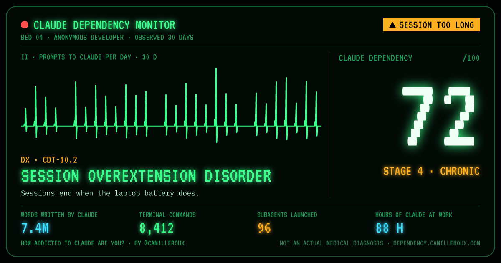

# Claude Dependency Test

> **How addicted to Claude are you?**

A Claude Code plugin that computes a **Claude dependency score out of 100** from the transcripts Claude Code already keeps on your machine, gives you an official-looking (and entirely fake) diagnosis, and publishes your case file as a page you can share.



- **Deterministic.** A local script does all the math with explicit, documented rules. Claude only adds a short "medical opinion" on top.
- **Private by construction.** It reads timestamps and a few enum-like fields, never the text of your prompts or Claude's answers. Only aggregate numbers are published, and the server rejects anything else. No account, no analytics.
- **Shareable.** An online report at a short link (`/case/<id>`) with its own preview image, a 1200×630 card, share buttons, and a README badge that always shows your latest score.

_Not an actual medical diagnosis. Unofficial fan project, not affiliated with Anthropic._

---

## Install

Inside Claude Code:

```
/plugin marketplace add camilleroux/claude-dependency-test
/plugin install claude-dependency-test@claude-dependency-test
```

Then run the test:

```
/claude-dependency-test:diagnose
```

Requirements: Node.js 18 or later on your `PATH`.

Options (pass them after the command, e.g. `/claude-dependency-test:diagnose --tz Europe/Paris`):

| Option | Effect |
| --- | --- |
| `--no-publish` | Stay fully offline: nothing is sent, you get a local card and a link that carries the card in its URL. |
| `--unpublish` | Delete your online report (page, preview image and badge). |
| `--new-link` | Publish to a new link instead of updating your existing one. |
| `--tz <IANA zone>` | Time zone for hours, days and weekends. Default: your system zone. |
| `--days <n>` | Only look at the last `n` days. |
| `--no-html` | Don't write the local HTML copy. |

You can also run the script directly, without Claude: `node plugins/claude-dependency-test/scripts/diagnose.mjs` prints the bulletin, and `--json` prints the aggregates.

## What you get

1. **A lab bulletin in your terminal**: score, stage, diagnosis, every symptom with its result, reference range and points.
2. **A short medical opinion and highlights** written by Claude from the aggregated JSON only.
3. **An online case file** at `https://<share-domain>/case/<id>`, opened in your browser: your score and a rubber-stamped diagnosis, then attendance calendar, 24-hour clock, side-effects leaflet, doctor's notes, pill-shaped model mix, symptom radar and a handwritten prescription, all from your real numbers. Share buttons (X, LinkedIn, Bluesky, Mastodon, copy image, native share) and a README badge. Link previews show your actual score. Running the test again **updates the same page**. See the [example](https://dependency.camilleroux.com/case/demo).
4. **An invitation to share** in Claude's answer: a ready-to-post text, one-click links, and the author's accounts to follow (configured in `share.follow`).
5. **`~/.claude-dependency-test/report.html`**: an offline copy with the card and a **Save as PNG** button (1200×630, rendered by your browser). Its Content-Security-Policy forbids every network request.

If the share site can't be reached, or with `--no-publish`, nothing is uploaded and the share link falls back to one that carries the card in its URL: `https://<share-domain>/r?s=73&st=4&a=nocturnal-genius&d=30&h=5.2&ad=87&sk=12&n=18&p=64&o=71&v=1`.

## Privacy

Rules the code follows:

- The script never extracts, stores or prints the text of prompts or responses, file paths, project names, git branches or identifiers.
- The computation is local and makes no network call. The only request is the publication of the aggregate report described below, which `--no-publish` turns off. No telemetry, no account.
- Claude never reads your transcripts for this test. The skill injects the script's JSON output and forbids `Read`, `Grep` and `Glob` for the turn.

### Exactly what is read

Transcripts: every `*.jsonl` under `$CLAUDE_CONFIG_DIR/projects` (default `~/.claude/projects`), including subagent transcripts. Each line is parsed with `JSON.parse`, then only these fields are accessed:

| Field | Used for |
| --- | --- |
| `type` | Keep only `user` and `assistant` lines. |
| `uuid` | De-duplication (held in memory, never output). |
| `timestamp` | All time-based metrics. |
| `isSidechain` | Subagent lines count toward models only, not activity or prompts. |
| `isMeta`, `isCompactSummary`, `isVisibleInTranscriptOnly` | Exclude injected or system messages from prompts. |
| `origin.kind`, `promptSource` | Identify prompts typed by a human (`origin.kind: "human"`, or `promptSource` in `typed`, `queued`, `suggestion_accepted`). |
| `message.content` (only whether it's a string or an array, and the `type` of each block) | Exclude tool results (`tool_result` blocks). |
| `message.id` | Count a multi-line API response once (held in memory, never output). |
| `message.model` | Model mix and Opus share. |
| `message.content[].type`, `message.content[].name` (tool calls only) | Tool usage counts. Tool **inputs are never read**. MCP tools are counted as "mcp", without server names. |
| `message.usage` (token counts) | Tokens written and processed, counted once per `message.id`. |
| `agentId` (subagent lines) | Number of subagents (ids stay in memory). |
| `subtype: compact_boundary`, `subtype: turn_duration` + `durationMs` (system lines) | Context compactions, longest solo run, time Claude spent on your requests. |
| Transcript folder of each file | Number of projects (a count; folder names are never output). |
| `error`, `isApiErrorMessage`, `quotaLimits.status`, `quotaLimits.resetsAt` | Detect usage-limit hits. |

Interruptions are counted from the `[Request interrupted` marker that Claude Code itself writes when you press Esc (only on lines without `origin`/`promptSource`, which are never prompts).

One exception, for **legacy transcripts only** (written before Claude Code added `origin`/`promptSource`): to tell a typed prompt from text that Claude Code injected, the script checks whether the first characters of a user message start with `<` (Claude Code's injected tags such as `<local-command-stdout>`) or `[Request interrupted`. The text is compared and discarded; nothing is kept.

Settings: only the `cleanupPeriodDays` key of `$CLAUDE_CONFIG_DIR/settings.json`.

### Exactly what is published

One JSON document per run, sent to `POST <share-domain>/api/diagnoses` (or `PUT` to update your page). It contains **only numbers and values from fixed lists**:

| Field | Content |
| --- | --- |
| `score`, `stage`, `archetype` | Your result (`archetype` is the diagnosis id). |
| `card` | Score, stage, archetype, window length and the ≤ 5 symptom numbers drawn on the card. |
| `window` | Length in days, first and last day (dates only). |
| `sample` | Number of prompts, sessions, active days, active hours. |
| `criteria` | For each of the 7 criteria: points earned, measured value(s) and thresholds. |
| `extras` | Peak hour, busiest weekday, current streak, longest session (hours), busiest day (date and prompt count). |
| `modelMix` | Share of responses per model **family** (`opus`, `fable`, `sonnet`, `haiku`, `other`), never raw model ids. |
| `usage` | Tokens written and processed; tool calls per built-in tool (fixed list, MCP grouped, rest as "other"); subagents, interruptions, compactions; longest solo run and total time Claude worked; number of projects; latest and earliest prompt times of day. |
| `hours`, `weekdays`, `daily` | Prompt counts per hour of day (24), per weekday (7), per day of the window. |

The server re-validates everything with the same strict parser ([`sanitizeReport`](plugins/claude-dependency-test/assets/card.js)): unknown keys are dropped, and any string that isn't a date or a fixed enum value rejects the whole document. So no page on the site can contain prompts, code, paths, project names or anything typed by a person. Nothing else is stored: no account, no IP address, no user agent (the rate limiter keeps a salted, irreversible hash of the IP for one hour). Anyone with the link can see a published report; pages are marked `noindex`. The site's [privacy policy](site/public/privacy.html) covers the GDPR details: legal bases, retention, processors, transfers and rights.

**Your link and how to delete it.** The server returns a random 10-character id and a secret token. The token is saved in `~/.claude-dependency-test/published.json` (mode 600) and stored only hashed on the server. It lets later runs update the same page and lets `--unpublish` delete it. Pages expire after 365 days without an update.

## How the data is cleaned

- **Multi-line responses.** One API response is written as several lines sharing a `message.id`. Models are counted once per `message.id`.
- **Resumed and forked sessions.** Resuming copies earlier lines verbatim (same `uuid`, same `timestamp`, new `sessionId`) into a new file. Every line is counted once per `uuid`.
- **Prompts are only what you typed.** Tool results, slash-command output, task notifications, hook output, compaction summaries, interruptions and subagent prompts are excluded.
- **Observation window.** Claude Code deletes transcripts older than `cleanupPeriodDays` (30 by default), but a session resumed recently keeps its old lines. The window is clamped to `[max(first activity, today − cleanupPeriodDays + 1), today]`, and the bulletin says when history was probably truncated.
- **Missing beats wrong.** A metric that can't be measured reliably is reported as "not assessed" with a reason, and the score is renormalized over the remaining criteria. It is never shown as 0.

## Metrics ("symptoms")

All times are in your local time zone.

| Symptom | Definition | Not assessed when |
| --- | --- | --- |
| Active hours per active day | Main-thread activity is split into sessions after 30 min of inactivity. Active time is the sum of gaps ≤ 30 min, divided by active days. | Never, once there's at least one prompt. |
| Days active | Days with at least one prompt ÷ days in the window. | Window < 7 days. |
| Longest streak | Longest run of consecutive active days. | Window < 7 days. |
| Night activity (shown, not scored) | Share of prompts sent between 00:00 and 04:59. | Fewer than 5 prompts. |
| Prompts per active day | Prompts ÷ active days. | Fewer than 5 prompts. |
| Weekend activity (shown, not scored) | Share of active time on Saturday and Sunday. | Window < 7 days. |
| Longest session | Longest run of activity without a 30-minute gap. | Never. |
| Subagents per active day | Distinct subagents launched ÷ active days. | Never (0 is a valid answer). |
| Words by Claude per active day | Output tokens (counted once per response) × 0.75 ÷ active days. | No token usage recorded. |
| Usage limits hit | Rate-limit errors (`error: "rate_limit"` or `quotaLimits.status: "rejected"`). Errors sharing a `resetsAt`, or within an hour without one, count as one hit. Normalized per 30 days. | No rate-limit or API-error markers at all (older Claude Code versions don't record them). |
| Model mix / Opus share | Share of responses per model family. `<synthetic>` error messages are excluded. | Fewer than 5 responses with a known model. |
| Peak hour | Hour of day with the most prompts. | Informational, not scored. |

## Scoring

The score measures **excess**: time spent, streaks, volume and delegation. It never scores *when* people work: night and weekend activity are shown on the page, but they don't count. Each criterion earns points **linearly** between two thresholds: 0 points at or below `from`, full points at or above `to`.

| Criterion | Points | 0 points at | Full points at |
| --- | ---: | --- | --- |
| Active hours per active day | 20 | 0.5 h | 8 h |
| Longest streak | 15 | 2 days | 21 days, or the window length if shorter |
| Presence (days active) | 10 | 15% | 90% |
| Intensity (prompts per active day) | 10 | 5 | 80 |
| Marathon (longest session) | 10 | 1 h | 6 h |
| Delegation (subagents per active day) | 10 | 0 | 8 |
| Output (words written by Claude per active day) | 10 | 15K | 300K |
| Usage limits hit (per 30 days) | 10 | 0 | 8 |
| Opus share | 5 | 0% | 100% |

```
score = round(100 × Σ earned points / Σ points of the criteria that could be assessed)
```

The rules live in [`plugins/claude-dependency-test/config/scoring.json`](plugins/claude-dependency-test/config/scoring.json): thresholds, weights, session gap, minimum samples, stage bounds and diagnosis mapping. Edit it to recalibrate. Nothing else is hard-coded.

### Headlines

Beyond the score, the most spectacular numbers are ranked by a "wow" ratio (the value divided by a reference an ordinary user rarely reaches: 3 × War and Peace written by Claude, 90-minute solo run, 40 subagents, 3-hour session, 10-day streak, 120 prompts in a day, 2,500 shell commands, 40 hours of Claude working, 40 interruptions). The top ones lead everywhere: the monitor's readouts, the share card, the terminal bulletin and Claude's chart notes.

### Stages

| Score | Diagnosis |
| --- | --- |
| 0-20 | Stage 1: Casual User |
| 21-40 | Stage 2: Regular |
| 41-60 | Stage 3: Dependent |
| 61-80 | Stage 4: Chronic |
| 81-100 | Stage 5: Terminal |

### Diagnoses

Your diagnosis is a made-up condition picked from the **dominant criterion**: the one with the highest share of its own points earned (ties go to the criterion worth more points). If none reaches 30%, it's Recreational Use.

| Dominant criterion | Diagnosis | Code |
| --- | --- | --- |
| Active hours | ⏳ Chronic Deep-Focus Syndrome | CDT-25.7 |
| Longest streak, presence | 🔥 Streak Dependency Syndrome | CDT-20.4 |
| Intensity | ⚡ Prompt Hyperactivity Disorder | CDT-15.9 |
| Marathon | 🔋 Session Overextension Disorder | CDT-10.2 |
| Delegation | 🧑‍💼 Middle-Manager Syndrome | CDT-10.6 |
| Output | 📚 Hypergraphia by Proxy | CDT-10.9 |
| Usage limits | 🚧 Chronic Limit Collision | CDT-10.8 |
| Opus share | 🍷 Opus Affluenza | CDT-05.5 |
| Nothing above 30% | 🍵 Recreational Use | CDT-00.1 |

The humor targets excess (long sessions, streaks, volume), never *when* people work.

## Offline share link format

`<baseUrl>/r?s=<score>&st=<stage>&a=<archetype>&d=<days>&<symptoms>&v=1`, where the symptoms are the (up to) five most severe ones shown on the card:

| Param | Meaning |
| --- | --- |
| `h` | Active hours per active day (1 decimal) |
| `ad`, `sk` | Days active (%), longest streak (days) |
| `p` | Prompts per active day |
| `l` | Usage limits hit in the window |
| `o` | Opus share (%) |
| `ls` | Longest session (hours, 1 decimal) |
| `sa` | Subagents hired in the window |
| `wd` | Words written by Claude per active day |

This format is only used when the report isn't published. The base URL is `share.baseUrl` in `scoring.json` (a placeholder until the site is deployed). Override it with the `CDT_SHARE_BASE_URL` environment variable.

## Configuration

| Setting | Where |
| --- | --- |
| Scoring rules | `plugins/claude-dependency-test/config/scoring.json` |
| Share domain | `share.baseUrl` in the same file, or `CDT_SHARE_BASE_URL` |
| Claude Code data directory | `CLAUDE_CONFIG_DIR` (honored), otherwise `~/.claude` |
| Don't open the browser | `CDT_NO_OPEN=1` |
| Never publish | `CDT_NO_PUBLISH=1` (same as `--no-publish`) |
| Accounts to follow | `share.follow` in `scoring.json` (and `FOLLOW` in `site/public/site-config.js`) |

## Why Node.js

- It's the runtime most Claude Code users already have, and the one the Claude Code ecosystem is built around.
- `readline` over `fs.createReadStream` streams transcripts line by line with constant memory, so files of tens of MB are fine (a test covers a 40+ MB file).
- Native `JSON.parse` and `Intl.DateTimeFormat` (for correct local hours in any time zone) mean zero dependencies.
- The card renderer is plain JavaScript shared by the script, the local report and the website.

## Repository layout

```
.claude-plugin/marketplace.json        Marketplace manifest (/plugin marketplace add)
plugins/claude-dependency-test/
  .claude-plugin/plugin.json           Plugin manifest
  skills/diagnose/SKILL.md             /claude-dependency-test:diagnose
  scripts/diagnose.mjs                 CLI entry point
  scripts/lib/                         collect → metrics → score → report → publish
  config/scoring.json                  All scoring rules
  assets/card.js                       Card model + canvas renderer (shared with the site)
  assets/report.template.html          Local report page
  test/                                Tests + synthetic .jsonl fixtures
site/                                  Share website + publishing API (see site/README.md)
```

## Development

```bash
npm test          # plugin, site, API and plugin→site integration tests (node:test)
npm run fixtures  # regenerate the synthetic transcripts
npm run diagnose  # run the test on your own data
```

The fixtures plant fake secrets (prompt text, paths, project and branch names) and the tests assert that none of them reaches the JSON, the terminal output, the HTML report or the data stored by the share site. They also cover duplicated multi-line responses, resumed sessions, subagents, legacy lines, retention clamping, time zones, renormalization and a 40 MB transcript.

## Author

Made by [Camille Roux](https://www.camilleroux.com/?ref=claude-dependency-test). Follow for new symptoms and features: [X @CamilleRoux](https://x.com/CamilleRoux) · [Bluesky @camilleroux.com](https://bsky.app/profile/camilleroux.com) · [Mastodon](https://mastodon.social/@camilleroux) · [LinkedIn](https://www.linkedin.com/in/camilleroux).

## License

MIT
